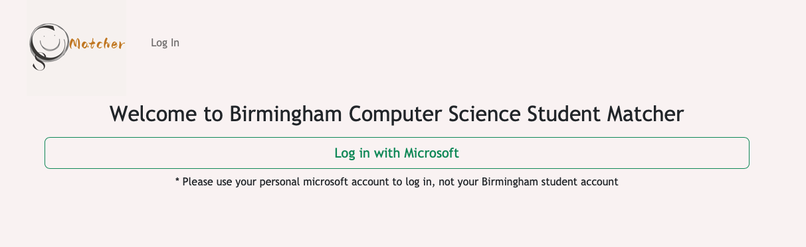
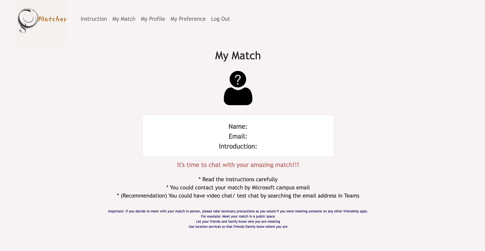
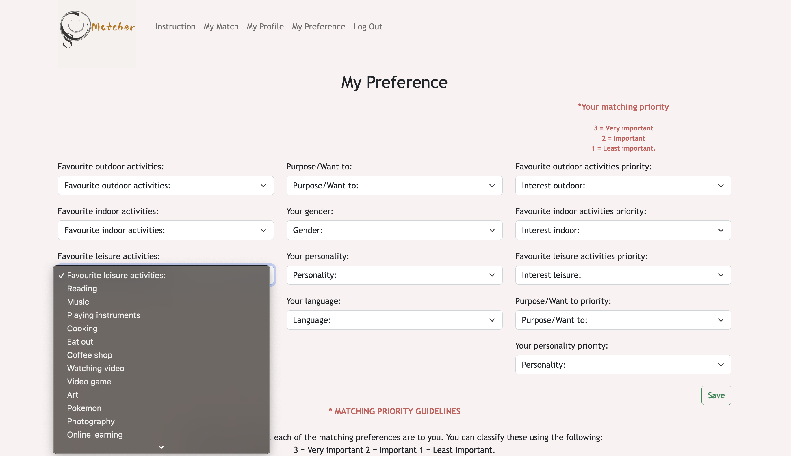

# CS Matcher (Classmate Social Web Application):blush:

CS Matcher is a web application designed to help students develop their social networks by connecting them with like-minded classmates. It utilises a combination of React, Django, and SQLite Database, along with the Stable Roommates Matching Algorithm, to facilitate efficient and effective matching between students.:fire::fire::fire:

## 

## 

## 

---

## Features

- User Registration and Authentication: Students can create an account and securely log in to the application using their Microsoft account credentials.
- Profile Creation: Users can create a profile by providing relevant information such as their name, interests, and preferences.
- Classmate Matching: The application uses the Stable Roommates Matching Algorithm to match students based on their profiles and preferences. This algorithm ensures fairness and optimises the compatibility of matches.

---

## Tools

This **React Frontend** project utilises the following technologies and tools:

- **React**: A JavaScript library for building user interfaces.
- **React Router**: A popular routing library for React applications.
- **Reactstrap**: A library that provides Bootstrap components as React components, allowing easy integration and customisation.
- **axios**: A popular JavaScript library used for making HTTP requests to the backend API.
- **@azure/msal-browser**:A library for integrating Microsoft Authentication Library (MSAL) with the browser to enable secure authentication.
- **@azure/msal-react**:
  A library that provides React components and hooks for easy integration with MSAL and handling authentication flows.
- **sweetalert2**: A library for displaying stylish and customisable popup notifications and alerts in React applications.

---

## Getting Started

Follow these steps to get the CS-Matcher running:

1. Clone the repository:

   ```shell
   git clone https://github.com/PatriciaHuang99/CS-Matcher.git

   ```

2. Navigate to the project directory:

   ```shell
   cd CS-Matcher

   ```

3. Create a sqlite database file since the db is ignored when push on the repository.

- Create a file named "db.sqlite3" under "django" directory

4. Navigate to the backend directory:

   ```shell
   cd django

   ```

5. Create the database tables in db.sqlite3 based on the Django models and migrations:

   ```shell
   python manage.py migrate

   ```

6. Run the django server:

   ```shell
   python3 manage.py runserver

   ```

   Keep the server running here~

7. Open new terminal and direct to React frontend:

   ```shell
   cd React

   ```

8. Install all the dependencies specified in the package.json file:

   ```shell
   npm install

   ```

9. Run the React frontend:

   ```shell
   npm start

   ```

10. Now, you can access the CS-Matcher at [http://localhost:3000](http://localhost:3000).

11. Now you can start to use the CS-Matcher :blush:

---
